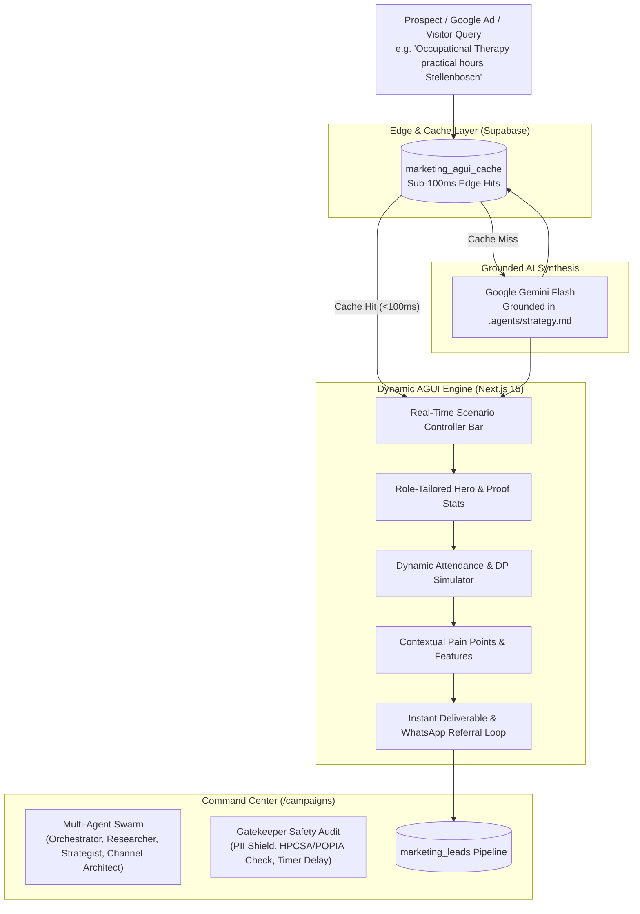

# Heykudu Growth & Marketing Platform (`about.heykudu.com`)

Welcome to the **Heykudu Growth, Marketing, and AGUI Engine** repository. This Next.js platform powers Heykudu's B2B university expansion across South African and global medical schools, academic hospitals, and higher-education institutions.

It combines an **AI Generative User Interface (AGUI) Engine**, an **Autonomous Multi-Agent Campaign Orchestrator**, a **Supabase Edge Cache**, and a **Real-Time University Lead Pipeline**.

---

## 📑 Table of Contents

1. [Architecture Overview](#-architecture-overview)
2. [What is the AGUI (AI Generative User Interface)?](#-what-is-the-agui-ai-generative-user-interface)
3. [The AGUI Engine (`/lp/ai`)](#-the-agui-engine-lpai)
4. [Autonomous Multi-Agent Staging System (`/campaigns`)](#-autonomous-multi-agent-staging-system-campaigns)
5. [Database Schema & Supabase Setup](#-database-schema--supabase-setup)
6. [Operational Management & Maintenance](#-operational-management--maintenance)
7. [Environment Variables](#-environment-variables)
8. [Local Development & Deployment](#-local-development--deployment)

---

## 🏛 Architecture Overview



---

## ⚡ What is the AGUI (AI Generative User Interface)?

In traditional web applications, a **GUI** (Graphical User Interface) delivers static copy, rigid diagrams, and one-size-fits-all sales pitches.

An **AGUI** (**AI Generative User Interface**) dynamically synthesizes the user interface in real time based on what the prospect is searching for and who they are. It writes the exact language, terminology, and workflows that prove immediate product-market fit:

* **For a Dean of Health Sciences:** Emphasizes institutional HPCSA/SANC accreditation defense, zero IT overhead, and tamper-proof legal audit trails.
* **For an OT or Nursing Course Convenor:** Emphasizes bedside logbook survival, 1-tap NFC supervisor sign-offs, and offline logging inside hospital basements.
* **For a Law or Commerce Lecturer:** Focuses on anti-proxy 2-second dynamic QR codes, geofencing, and eliminating student attendance disputes.
* **For a Medical Student / Class Representative:** Highlights Duly Performed (DP) protection, automated Red-Amber-Green (RAG) deficit tracking, and 1-click WhatsApp course referral.

### Grounding & Guardrails
All generated AGUI interfaces are strictly grounded in verifiable technical facts from [`.agents/strategy.md`](./.agents/strategy.md):
1. **Offline-First Mobile Architecture**: Works without mobile cellular data in hospital basements and rural clinics; syncs automatically on campus Wi-Fi.
2. **Anti-Proxy Dynamic QR**: 2-second auto-refreshing QR codes bound to physical screens prevent buddy check-ins and attendance forgery.
3. **1-Tap NFC Supervisor Sign-Off**: Preceptors and clinical sisters tap student badges directly with a smartphone to authenticate clinical competencies in under 30 seconds.
4. **Sub-Meter GPS Geofencing**: Validates student presence on ward grounds without continuous battery-draining GPS tracking.
5. **Real-Time DP RAG Status**: Live Red-Amber-Green progress bars give leadership and students early warnings weeks before exam DP lockouts.
6. **Zero IT Friction**: Free forever up to 35 students; course convenors can self-deploy in 2 minutes without opening university IT service tickets.
7. **Empirical South African Proof**: Grounded in Wits GEMP 2 Paediatrics clinical rotations across Charlotte Maxeke Johannesburg Academic Hospital and Chris Hani Baragwanath Academic Hospital.

---

## 🚀 The AGUI Engine (`/lp/ai`)

* **Live URL:** [`https://about.heykudu.com/lp/ai`](https://about.heykudu.com/lp/ai)
* **Code Implementation:** [`src/app/lp/ai/page.tsx`](./src/app/lp/ai/page.tsx)
* **Backend Generator:** [`src/lib/marketing/aguiGenerator.ts`](./src/lib/marketing/aguiGenerator.ts)
* **API Route:** [`src/app/api/marketing/agui/route.ts`](./src/app/api/marketing/agui/route.ts)

### How It Works:
1. **URL Parameters**: Accepts `?q=<search_intent>&role=<target_role>&institution=<university>`.
2. **Top Scenario Controller**:
   - Visitors or internal team members can type any custom query or select preset scenario chips (*Medical Dean*, *Occupational Therapy*, *Nursing Clinical Skills at SMU*, *Student DP Rescue*).
   - Displays live latency metrics and indicator badges (*Synthesized Live in Xms* vs *Edge Cached <100ms*).
3. **Adaptive Attendance & DP Simulator**:
   - Calibrates metric names (`hours`, `practical sessions`, `deliveries`), baseline requirements, and attendance thresholds dynamically based on the query.
   - Allows users to drag the slider to witness real-time RAG compliance status changes.
4. **Fast-Track Self-Service Banner**:
   - Direct link to [`heykudu.com`](https://heykudu.com) for zero-human-intervention class deployment.
5. **Inbound Lead Capture & WhatsApp Viral Referral**:
   - Captures name, institutional email, phone/WhatsApp, and nominated course details.
   - Automatically generates a pre-filled WhatsApp invitation link (`wa.me/?text=...`) for student reps to forward directly to their class groups or course convenors.
   - Dispatches a tailored institutional toolkit PDF.

---

## 🤖 Autonomous Multi-Agent Staging System (`/campaigns`)

* **Live URL:** [`https://about.heykudu.com/campaigns`](https://about.heykudu.com/campaigns) (Protected by PIN: `wits2026`)
* **Code Implementation:** [`src/components/campaigns/FunnelHubView.tsx`](./src/components/campaigns/FunnelHubView.tsx)
* **Agent Definitions:** Located in [`.agents/`](./.agents/)

### Agent Team:

| Agent | Specification File | Role |
|:---|:---|:---|
| **Orchestrator** | [`.agents/agents/orchestrator.md`](./.agents/agents/orchestrator.md) | Deconstructs campaign prompts, coordinates stage transitions, and enforces deadlines. |
| **Institutional Researcher** | [`.agents/agents/institutional-researcher.md`](./.agents/agents/institutional-researcher.md) | Researches South African university faculties, accreditation bodies (HPCSA, SANC), and Deanery pain points. |
| **Creative Strategist** | [`.agents/agents/creative-strategist.md`](./.agents/agents/creative-strategist.md) | Frames messaging using loss aversion (e.g. lost accreditation, DP student disputes, spreadsheet chaos). |
| **Channel Architect** | [`.agents/agents/channel-architect.md`](./.agents/agents/channel-architect.md) | Synthesizes multi-channel copy (Landing pages, Google Ads, Cold Email drip sequences, WhatsApp referral scripts). |
| **Gatekeeper** | [`.agents/agents/gatekeeper.md`](./.agents/agents/gatekeeper.md) | Mandatory safety agent. Audits all content for PII leaks, HPCSA/POPIA compliance, and messaging quality before anything goes live. |

### Human-in-the-Loop & Publishing Safeguards:
1. **Prompt Ingestion**: Campaigns can be initiated manually via the UI prompt box or automatically via GitHub merge webhooks (`/api/marketing/github-webhook`) when new platform features merge to `main`.
2. **Deep Research & Strategy Generation**: Agents collaborate in staging to produce full creative assets and channel deliverables.
3. **Gatekeeper Audit**: The Gatekeeper agent scans every element for personal identifiable information (PII) and factual accuracy.
4. **Timer Delay on Publishing**: Campaigns feature a configurable countdown delay before go-live, allowing human review and manual override.
5. **Element Go-Live Verification**: Campaigns only reach `live` status when all requisite channels (Landing page, Google Ads, Emails) are reviewed and published.

---

## 🗄 Database Schema & Supabase Setup

Database migrations are maintained in the main platform repository under `heykudu.com/supabase/migrations/` and deployed to Supabase.

### 1. `marketing_agui_cache` Table
Migration: `20260930100000_marketing_agui_cache.sql`
```sql
CREATE TABLE IF NOT EXISTS public.marketing_agui_cache (
    id UUID PRIMARY KEY DEFAULT gen_random_uuid(),
    cache_key TEXT NOT NULL UNIQUE,
    query TEXT NOT NULL,
    target_role TEXT,
    faculty TEXT,
    institution TEXT,
    payload JSONB NOT NULL,
    hit_count INTEGER DEFAULT 1,
    created_at TIMESTAMPTZ DEFAULT now(),
    updated_at TIMESTAMPTZ DEFAULT now()
);
```

### 2. Marketing Engine Tables
Migration: `20260930060000_marketing_engine_schema.sql`
* `marketing_campaigns`: Stores campaign ideas, agent state, timer delays, and status (`draft`, `researching`, `in_review`, `scheduled`, `live`).
* `marketing_campaign_elements`: Stores individual deliverables (landing page copy, email sequences, Google ad headlines, gatekeeper audit status).
* `marketing_leads`: Stores inbound university leads, institutional role, requested deliverables, course nominations, and UTM parameters.
* `marketing_pages`: Stores dynamically generated landing page slugs and content blocks.

---

## 🛠 Operational Management & Maintenance

### 1. How to Pre-Warm and Manage the AGUI Cache
To ensure instant (<100ms) page loads for key target faculties:
1. Navigate to [`about.heykudu.com/campaigns`](https://about.heykudu.com/campaigns) and enter PIN `wits2026`.
2. Select the **✨ AGUI Engine & Playground** tab.
3. Enter the search query (e.g. `Emergency Medicine clinical procedures UCT`).
4. Click **Synthesize AGUI Variant**. The system queries Gemini Flash, saves the output to `marketing_agui_cache`, and displays the live preview.
5. Subsequent visits to `/lp/ai?q=Emergency+Medicine+clinical+procedures+UCT` will serve directly from the edge cache.

### 2. How to Launch a New Campaign
1. Open [`about.heykudu.com/campaigns`](https://about.heykudu.com/campaigns).
2. Enter your campaign concept into the **New Campaign Prompt** field (e.g. *Target Stellenbosch Tygerberg campus physiotherapy department for semester 2 clinical logbooks*).
3. Click **Initiate Multi-Agent Staging**.
4. The agent swarm will perform institutional research, write messaging, and generate multi-channel assets.
5. Review the Gatekeeper audit badge and set the publishing timer delay.
6. Click **Approve & Go Live** when ready.

### 3. How to Connect Google Ads to AGUI
To leverage dynamic real-time personalization in Google Ads:
* Set your ad destination URL using ValueTrack parameters:
  ```
  https://about.heykudu.com/lp/ai?q={KeyWord:clinical+attendance+tracking}&role=Course+Convenor&utm_source=google_ads&utm_campaign=b2b_search
  ```
* When prospects search for a specific term (e.g. *midwifery skills logbook*), the landing page dynamically adapts its headline, proof points, and simulator without creating hundreds of static landing pages.

### 4. How Inbound Leads are Managed
* Leads submitted through `/lp/ai` or any `/lp/[slug]` funnel page are instantly written to `marketing_leads`.
* View and filter new submissions under the **📥 University Inbound Leads** tab on `/campaigns`.
* For student-nominated courses, follow up directly with the provided lecturer email and share the 1-click pilot activation link.

---

## 🔑 Environment Variables

The application requires the following environment variables (configured in `.env.local` for local development and in Vercel for production):

```env
# Supabase Configuration
NEXT_PUBLIC_SUPABASE_URL="https://zzktbnlrhbbnuencvdtb.supabase.co"
NEXT_PUBLIC_SUPABASE_ANON_KEY="eyJhbGciOi..."
SUPABASE_SERVICE_ROLE_KEY="eyJhbGciOi..."

# Google Gemini API (AGUI Synthesis & Agent Orchestration)
GEMINI_API_KEY="AIzaSy..."

# Campaign Command Center Security
CAMPAIGN_ADMIN_PIN="wits2026"

# Host Configuration
NEXT_PUBLIC_APP_URL="https://about.heykudu.com"
```

> [!NOTE]
> The Gemini API model alias used for low-latency AGUI generation is `gemini-flash-latest` via the Google Generative Language v1beta endpoint.

---

## 💻 Local Development & Deployment

### Install Dependencies
```bash
npm install
```

### Run Local Development Server
```bash
npm run dev
```
Open [http://localhost:3000](http://localhost:3000) to view the marketing site, [http://localhost:3000/lp/ai](http://localhost:3000/lp/ai) for the AGUI engine, and [http://localhost:3000/campaigns](http://localhost:3000/campaigns) for the Command Center.

### Run TypeScript & Production Build Verification
```bash
npx tsc --noEmit
npm run build
```

### Deploy to Production
Production deployments trigger automatically on push to the `main` branch via Vercel:
```bash
git add .
git commit -m "feat: your feature description"
git push origin main
```
To verify the live deployment:
```bash
curl -I https://about.heykudu.com/lp/ai
```
